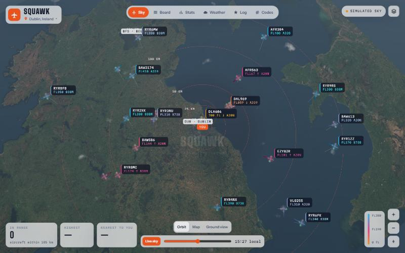
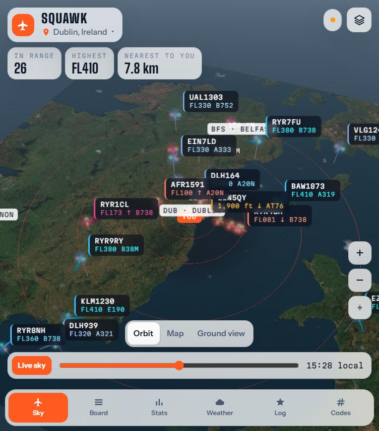
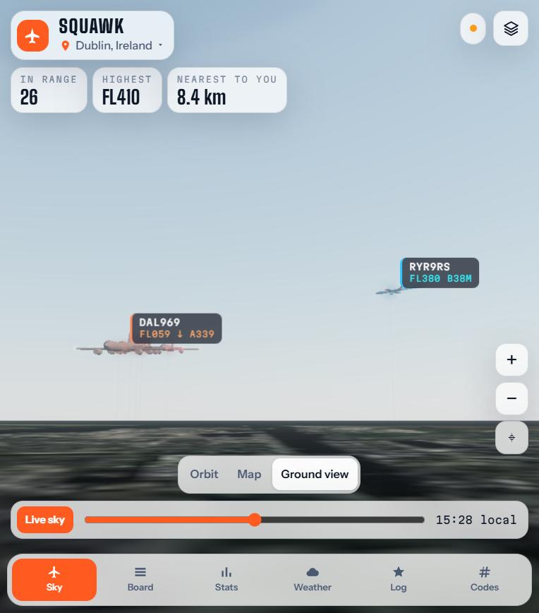

# SQUAWK

**The sky above you, live in 3D.** Squawk is a plane-spotting app that shows every aircraft around you, in real time, over satellite imagery. The sun sits where it really is right now, and the clouds follow the live weather. Tap any aircraft and Squawk tells you exactly where to look to see it with your own eyes.



<p> </p>

## Features

- **A whole live planet.** Squawk opens in space and drops down to you. Zoom out, or tap **Globe**, to spin the earth and watch live traffic across continents. Satellite tiles stream in as you zoom, with borders, place names and city lights on the night side.
- **Live aircraft** from community ADS-B networks (ADSB.lol, airplanes.live and adsb.fi). Around you it refreshes every 5 seconds; look somewhere else and the feed follows the camera, with a wider radius the further out you zoom.
- **Recentre anywhere.** Wherever you've wandered, *Back to home*, the ⌖ button or the **H** key flies you straight back.
- **Use your current location**, search any city or airport, or jump to a busy sky: Heathrow, Dubai, Mumbai, New York and more.
- **A real-world scene.** Satellite ground imagery with earth curvature. The sun's position is calculated for your location and time. Cloud cover, wind and haze come from live weather.
- **Camera views.** *Orbit* is the 3D overview. *Map* is top-down. *Globe* pulls out to see the planet. *Ground view* puts you on the ground looking up at true angles, so the scene matches what you see outside.
- **Controls.** Drag to move, scroll or pinch to zoom, right-drag (or two fingers) to turn and tilt, double-click to zoom in on a spot.
- **Look ahead.** A countdown to the next plane passing over you, and alerts (with an optional chime and system notification) for overhead passes, rare aircraft and new types.
- **Sun and moon transits.** Squawk predicts aircraft crossing the sun or moon and draws the line on the ground from which the crossing is dead centre, so you know how far to walk.
- **Contrail forecast** from upper-air temperature and humidity: which planes should leave a trail, and whether it will linger. They leave white trails in the 3D view.
- **Satellites.** The ISS, Tiangong, Hubble and about 150 of the brightest satellites, with visible passes for the next 24 hours.
- **Aircraft you can recognise:** ten model families (A380, 747, widebodies, turboprops, helicopters and more) with tails in airline colours.
- **Made for newcomers.** A first-sighting guide walks you to a plane you can see right now. Tap "I saw it!" to log real sightings, earn XP and levels, keep a streak, complete daily missions, and collect 24 aircraft families.
- **Photo mode** (P) hides the interface and saves a picture. An optional **rain radar** layer covers the globe.
- **Time scrubber** to preview the sky at golden hour, sunset or night.
- **Flight cards** with a photo of the actual aircraft (Planespotters.net), the route, altitude, speed, squawk code and a "where to look" sky dial.
- **Tabs:**
  - **Board:** a split-flap departures board of the nearest aircraft, plus a feed of landings, heavies, emergencies and overhead passes.
  - **Stats:** an altitude histogram, top airlines, aircraft sizes, a traffic trend and session records.
  - **Weather:** a spotting-conditions score, cloud layers, surface wind and jet stream, and sunrise, sunset and golden hour.
  - **Next:** your sky today, overhead passes, sun and moon transits, rare aircraft, satellite passes and contrails.
  - **Log:** your level, streak and daily missions, the aircraft family collection, the types you've caught and 16 badges.
  - **Codes:** what the transponder squawk codes mean.
- If no live feed is reachable, Squawk falls back to realistic **simulated traffic** around the nearest major airport.

## Getting live data

The community ADS-B networks don't send CORS headers, so a browser can't read them straight from a static host like GitHub Pages. On a static host Squawk shows realistic simulated traffic instead. There are three ways to get live aircraft:

1. **Deploy on Vercel (easiest).** Go to [vercel.com/new](https://vercel.com/new), import this repo and click **Deploy**. The included `vercel.json` relays the feed through your own domain. Netlify works the same way through `_redirects`.
2. **Keep GitHub Pages and add a relay.** Deploy `worker/cors-relay.js` as a free Cloudflare Worker (Workers → Create → paste → Deploy). Then paste the worker URL into Squawk's layers menu under *Live feed*, or open the site with `?relay=https://your-worker.workers.dev`.
3. **Run it locally** with `python3 serve.py`. It serves the site and relays the feed.

Weather, routes (adsbdb.com), photos and place search all work straight from the browser, so they don't need a relay.

## Run it locally

There's no build step. The included server also relays the live feed:

```bash
python3 serve.py
# open http://localhost:8000
```

Three.js r170 loads from jsDelivr through an import map. Geolocation needs `https://` or `localhost`.

## Project layout

```
index.html        UI shell and import map
css/style.css     glass UI that follows day and night
js/main.js        app state, live feed, labels, tabs, badges
js/world.js       three.js scene: sky, clouds, aircraft, trails, globe camera and controls
js/globe.js       streaming globe: map tiles on a sphere, place names, night lights, atmosphere
js/data.js        airlines, aircraft types, airports and network sources
js/sim.js         simulated traffic fallback
js/predict.js     overhead passes, sun/moon transits, contrail physics
js/sats.js        satellites from CelesTrak, positions and visible passes
js/models.js      aircraft model families and airline tail colours
js/spotter.js     collection families, levels, missions, plain-English facts
js/geo.js         projection, earth-centred frame, earth curvature, sun position
serve.py          local server with a live-feed relay
vercel.json       Vercel config that relays the feed
_redirects        Netlify config that relays the feed
worker/           Cloudflare Worker relay for static hosts
```

## Data and credits

Aircraft positions come from [ADSB.lol](https://adsb.lol), [airplanes.live](https://airplanes.live) and [adsb.fi](https://adsb.fi), and routes from [adsbdb.com](https://www.adsbdb.com). Photos come from [Planespotters.net](https://www.planespotters.net), weather from [Open-Meteo](https://open-meteo.com), and geocoding from [OpenStreetMap Nominatim](https://nominatim.openstreetmap.org). Imagery, borders and place names are © Esri, Maxar and Earthstar Geographics. City lights are NASA Black Marble via [NASA GIBS](https://earthdata.nasa.gov/gibs). Map tiles are © OpenStreetMap contributors and © CARTO. The 3D rendering uses [three.js](https://threejs.org).

Satellite orbits come from [CelesTrak](https://celestrak.org) and are propagated with [satellite.js](https://github.com/shashwatak/satellite-js). Rain radar is from [RainViewer](https://www.rainviewer.com).

Squawk is for spotting fun, not for navigation.
